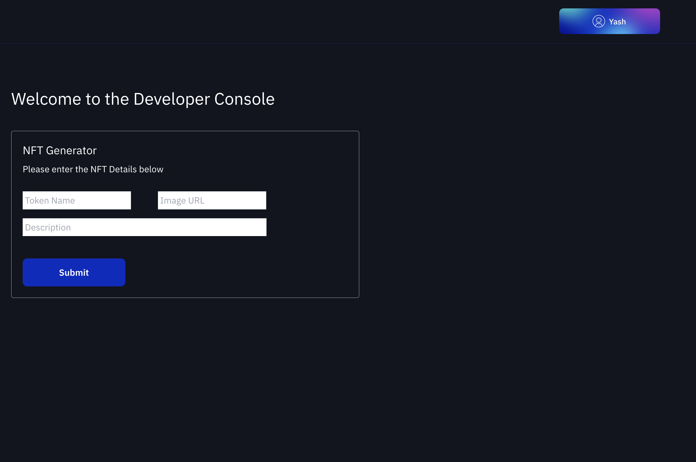

# Non Fungible Resource Generator

This is a demo project that will allow any user to mint a non-fungible token to its
address.

## Components

This app has 2 main components :-

1. Server in Rust
2. Client in Svelte (TS)

## Server

The server was written in rust to use [Rust Manifest Builder](https://docs.radixdlt.com/docs/rust-manifest-builder). The server only exposes 1 call - `getManifest` which simply builds the mainfest and returns the string. Here is the snippet

```rust
let manifest = ManifestBuilder::new().create_non_fungible_resource(
        OwnerRole::None,
        NonFungibleIdType::Integer,
        true,
        NonFungibleResourceRoles::default(),
        metadata! {},
        Some(indexmap! {
            NonFungibleLocalId::integer(1) => NFTData {
                name: body.clone().name,
                description:body.clone().description,
                image_uri: body.clone().image_uri,
            },
        }),
    );

    let obj_names = manifest.object_names();
    let manifest_string =
        decompile_with_known_naming(&manifest.build().instructions, &network, obj_names)
            .unwrap_or("".to_string());
```

## Client

The client is in Svelte with TS and Tailwind. I have used an example of `create-radix-dapp`.

Here is the screenshot :-



## Authors

- [@iamyxsh](https://www.github.com/iamyxsh)
